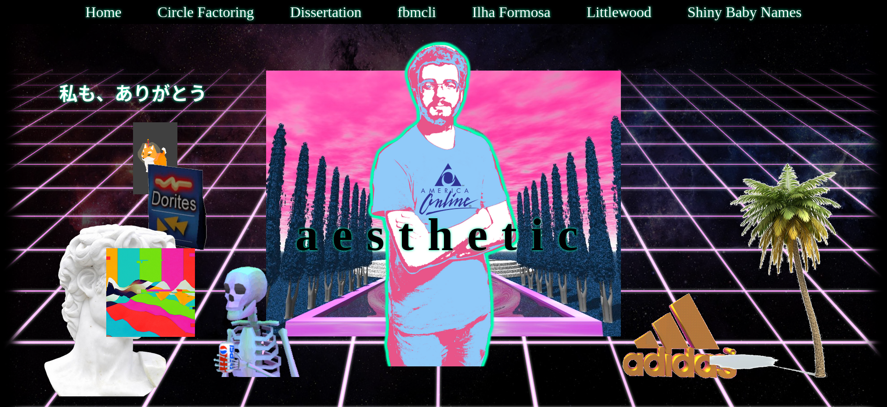

# A static site generator is just a pure function

Most websites I use are web _apps_ instead of web _pages_, which either require a lot of client-side JavaScript, or a server for dynamic content.
If you don't need interactivity, a [static site generator](https://jamstack.org/generators/) (SSG) can simplify a website with many pages.

## My website

For my website, I started in 2018 with [Pelican](https://getpelican.com/) before moving to [Hugo](https://gohugo.io/) which are both template-based SSGs.
These are some of the simplest and most common kinds of SSGs, you just sprinkle your HTML with `{{ special templating syntax }}` like [jinja2](https://jinja.palletsprojects.com/) and the SSG generates your website.
You can insert things like variables, HTML snippets or rendered markdown and run some control flow logic on the data like conditionals and loops.
For most websites, templates strike a good balance of high power for their low complexity.
For example, my website was initally just a homepage and a few sub-pages written in markdown, which is exactly the happy path for these kinds of tools.

Once I decided to do some more complex processing to the input data, the template expressions became long and inflexible.

The alternative to a "template-based" SSG is a "framework-based" SSG.
These SSGs use dynamic frontend web frameworks that are designed for web apps, but instead of dynamically rendering the page at runtime, they statically render the entire site at build time.
I used [Gatsby](https://www.gatsbyjs.com/) which is based on React, and uses JavaScript/TypeScript for all the data transformations.
Because you get to use a "proper" language to write your site, you get a lot more freedom to do whatever you want at build time, and Gatsby integrates a data store that can be queried in your components using GraphQL.
I managed to build the site that I couldn't with Hugo's templates, but the complex pipeline of processing data was slow, and I occasionally wanted a slightly more powerful query language than what Gatsby's GraphQL system offered.
The biggest hurdle was when I wanted to step outside what the existing plugins offered, I found extending the engine very difficult.
In fact, I found it so difficult that it made me wonder if all this complexity was worth it and if it might be easier to just write my own static site generator...

## A component is just a pure function

Following in a [long tradition](https://hn.algolia.com/?query=my%20own%20static%20site%20generator&type=story), I wrote my own SSG.
I liked how it felt to mix normal code with HTML elements, but didn't know how I'd go about implementing that in another language, and I wasn't sure how to combine HTML elements into reusable components.
The solution to this problem is obvious to anyone who's used [Elm](https://elm-lang.org/) or something similar before — an element tag in React is just a pure function that returns an HTML string, and components are just compositions of these functions!

```julia
# A simplified example of what a tag function might look like
function tag(name, inner_html; attributes)
    attributes_joined = join(["$k = \"$v\"" for (k,v) attributes], " "))
    return "<$(name) $(attributes_joined)>$(inner_html)</$(name)>"
end
```

I decided to build my new SSG in Julia using [Genie.jl](https://genieframework.com/) to output the HTML string.
Julia's multiple dispatch and [`do` notation](https://docs.julialang.org/en/v1/manual/functions/#Do-Block-Syntax-for-Function-Arguments) combined to make an (in my opinion) pretty readable DSL, similar to React.

```julia
div(class="box") do
    [
        h1("A heading"; id="title"),
        p("A paragraph with some ", b("formatting"), "."),
    ]
end
```

I got most of the way through writing my new SSG, but development slowed a lot near the end.
I had made it very difficult to manage all the side effects like downloading the font files, downloading the blog posts to a temporary directory, unzipping them, and then making sure all the right files were written to.
I also struggled to pass the right information to each component, which made me miss Gatsby's slow and limited GraphQL queries.

## A static site generator is also a pure function

In the last few months, I've become very interested in the [Roc programming language](https://roc-lang.org/).
One of the things that attracted me to it is that it is a completely pure language, meaning it is impossible to do any side effects in Roc.
Roc solves this by making each program have an associated "platform", some non-Roc code that essentially calls your Roc code like a library.
I've found this concept of separating the effectful IO from the core logic very useful for simplifying complex programs.
It gives me the ability to collect all the input effects like file reads and network requests into one place, put the output effects in another place, and then focus on all the parsing and data transformation logic in between.
Working in this ["functional core imperative shell"](https://kennethlange.com/functional-core-imperative-shell/) style led me to realise that an SSG is also just a pure function, in this case a function from blogposts, CSS and fonts to a list of files and their contents.

Following this logic, the new SSG I wrote has three steps: input, pure transformations, and then output.
In the input step, I download all the assets, read the content files and save it all into a big JSON file as a cache.
In the second step, I read this big JSON file into a typed object and use that data to build all the pages and assets.
Having all the inputs in one variable gives me an alternative to Gatsby's queries: by passing this object to every page and component, I can "query" it with normal Python syntax.
For example, to get a list of the blog post titles, I can use a Python list comprehension:

```python
blogpost_titles = [blogpost.title for blogpost in data.blogposts]
```

The result of this pure build step is a dictionary object that maps a file path to the contents of that file, either an HTML page or an asset like an image or font file.
The final output step just takes this dictionary and writes all the pages and assets to their designated file paths.

## Rewriting again

I used Python for my SSG, which doesn't automatically manage side effects, so I had to just be careful with where I did side-effects.
It wasn't a problem because my SSG is small enough to fit in my head, but I can imagine how a pure language like Roc would give this same level of confidence to a large team where no one has a complete understanding of the codebase.

If web components and SSGs are like pure functions, then what else is?
I hope by writing more Roc code I'll find out :)
